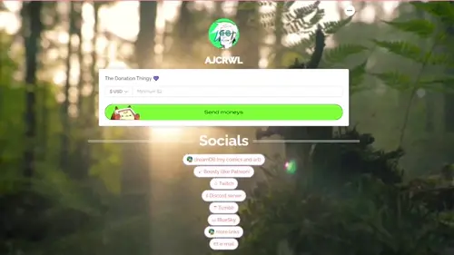
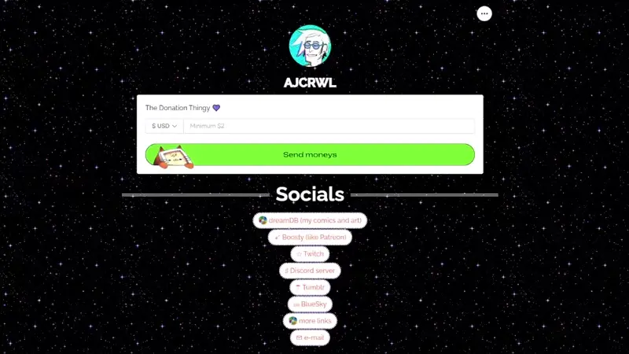
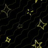

# Как поставить картинки на фон страницы Hipolink

Сразу начну с того, что все манипулияции с фоном происходят **не** с элементом `body` или `html`, а с `div.UserPage_blurContainer__d0diX`. Это такой контейнер для фона темы, который растягивается на 100% ширины и высоты и сидит позади контента вашей страницы.

В гайде будет сначала разбор "как оно у меня", а потом примеры, как можно еще сделать (спойлер: всё равно вернёмся к тому, как оно у меня).

### Как оно у меня...

Многие спрашивали "Как сделать гифку на фон как у вас?", и короткий ответ: всё сложно 😅.

1) Самое простое и необязательное: в конструкторе у меня установлена тема с градиентом, которая задает цвета всей страницы:


2) В одном из блоков HTML у меня прописан такой код:

```html
<style>
/* page bg */
.UserPage_blurContainer__d0diX {
    background: url(ССЫЛКА НА ФАЙЛ КАРТИНКИ), repeating-linear-gradient(45deg, #F2E100, #EF7C53) !important;
    background-blend-mode: soft-light;
}
</style>
```

Для этого мне пришлось подсмотреть в коде страницы цвета, установленные моей темой, и добавить к ним ещё параметров.

По идее, можно использовать, например, [colorpicker.me](https://colorpicker.me/#76fe33) или [cssgradient.io](https://cssgradient.io), и сделать свой градиент, подставив вместо моих `#F2E100` и `#EF7C53` другие hex коды для цветов. Или вообще заменить стандартное `repeating-linear-gradient(45deg, #F2E100, #EF7C53)` на то, что предложит сайт с градиентами: у них обычно, что-то вроде `linear-gradient(45deg, rgba(238,174,202,1) 0%, rgba(148,187,233,1) 100%)`. В этой строчке важно, чтобы в конце стояло `!important;`.

Строка `background-blend-mode: soft-light;` нужна, чтобы моя анимированная "гифка" мягко смешивалась с градиентом на фоне, иначе получалось вырвиглазно. Можно и без неё, если результат вас устроит.

3. Моя гифка.... не гифка.


Мне хотелось, чтобы было "типа как на geocities", она небольшая - всего 100х100 px, отрисована руками с нуля, звездочки моргают, всё шевелится, и сделано так, чтобы она была с прозрачностью и могла бесшовно повторяться на фоне. Но при экспорте в формат gif, все нещадно шакалилось, полупрозрачные линии на фоне пропадали, из моей красивой анимации получалось вот такое днище:


Поэтому моя "гифка" на самом деле превратилась в apng! То есть png с анимацией.

Рассказывать, как рисовать бесшовные пикчи - долго, лучше ищите в ютюбе, что-то по теме *how to create seamless patterns photoshop*. Для анимации придется этих паттернов делать несколько - по одному на кадр. Потом экспортировать кадры в png, и комбинировать в apng при помощи [ezgif](https://ezgif.com/apng-maker), например.

Но всё это произошло чисто из-за моих загонов с прозрачностью и качеством. Если у вас есть гифка с прозрачностью, которая вам нравится, можете просто воткнуть url на нее в код и радоваться жизни `¯\_(ツ)_/¯`

## ПОЧЕМУ ТАК СЛОЖНА. ДАВАЙ ПРОЩЕ!!!1

### Как поставить обычную картинку на фон

Возьмём живописное [фото с википедии](https://en.wikipedia.org/wiki/File:Mount_Mitchell-27527.jpg).

Градиент нам тут совсем не нужен, и дополнительно указываем, что фон растянуть надо на всю страницу:

```html
<style>
/* page bg */
.UserPage_blurContainer__d0diX {
    background: url(СЮДА ВСТАВИТЬ ССЫЛКУ НА КАРТИНКУ) !important;
    background-size: cover !important;
}
</style>
```
И вот мой Хиполинк переехал куда-то в Аппаллачи:


##### А что если гифку?

Да всё то же самое.

Ну вот например какой-то классный мох в лесу принимает солнечные ванны:


Вставляем ссылку в код выше и ЕЕЕЕ ЛЕСНАЯ ХТОНЬ



### Как поставить картинку на фон, но чтобы повторялось

Найдём в гугле какой-нибудь повторяющийся паттерн, который разрешено использовать (я возьму пикчу от Webtreats).

Тут всё ещё проще! Потому как паттерн должен повторяться, нам надо указать только ссылку на картинку!

```html
<style>
/* page bg */
.UserPage_blurContainer__d0diX {
    background: url(СЮДА ВСТАВИТЬ ССЫЛКУ НА КАРТИНКУ) !important;
}
</style>
```

Красивое ( ★‿★)


#### А если всё же гифку?

Возьмём звёздочки с giphy:


Подставляем в код иии

мерцательное!



Так, пажжите, а что если я засуну туда градиент, и смешаю их через color-dodge...


```html
<style>
/* page bg */
.UserPage_blurContainer__d0diX {
    background: url(https://i.giphy.com/media/v1.Y2lkPTc5MGI3NjExZHEweHFrMDZmcWJmcTZ2bXN0c2diMnMybGZ0bXp4YnJhaXg4cDU3dSZlcD12MV9pbnRlcm5hbF9naWZfYnlfaWQmY3Q9Zw/FlodpfQUBSp20/giphy.gif), linear-gradient(45deg, #F2E100, #EF7C53) !important;
    background-blend-mode: color-dodge;
}
</style>
```


**Так, это что же такое, это мы вернулись к тому, с чего начинали???**

ТАК ПАЖЖИТЕ, а если я свою гифку экспортирую не с прозрачным фоном, а черным?



Не пошакалилось! 

...и смешаю как раньше?


То есть... можно было просто экспортировать на черном фоне и не париться с apng????? (＠_＠;)

Вот так век живи, век переизобретай костыли х)

```html
<style>
/* page bg */
.UserPage_blurContainer__d0diX {
    background: url(ПИКЧА), linear-gradient(45deg, #F2E100, #EF7C53) !important;
    background-blend-mode: screen;
}
</style>
```

Только в этом случае более приятный вид смешения получился через screen.

### PS.

Пожалуйста, не добавляйте на страницу тяжелые картинки. Хипо больше заточен под мобильные устройства, а это значит, что большие картинки будут сильно съедать трафик. До 1.5 MB было бы идеально, но еще лучше - при помощи того же [Ezgif](https://ezgif.com/webp-maker) конвертируйте их в Webp (в верху страницы есть варианты из какого формата). Вот например гифка с мхом ужалась с 1.16 MB почти в четыре раза до 313.74 KB.


Можно было бы еще много интересных фишек сделать с фоном, но пока остановимся на этом :>

---


Вот и всё. Надеюсь, туториал помог, подкинул идей, и не был слишком сложным.


[Другие гайды для Хиполинка](./)

Спасибы в виде деняк принимаю на [Хипо](https://hipolink.me/ajcrwl) или [Бусти](https://boosty.to/doittkarl).

