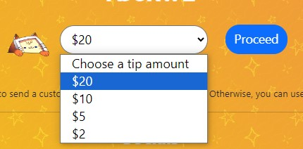
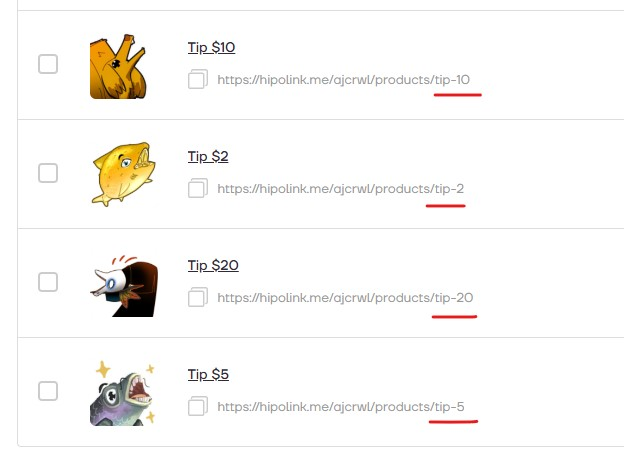

# Виджет для выбора суммы доната на Hipolink

> [!Может быть не актуально:]
> На хиполинке сделали возможность установить минимальную цену на товар и позволить покупателю платить больше этой цены, сколько захотят. Теперь можно обойтись всего одним "товаром" для доната с ценой, скажем, в $1.
> Код оставлю для истории, но больше не вижу в нём смысла, когда можно обойтись одной кнопкой.

 



Чтобы код работал, надо чтобы все ссылки на странички разных сумм назывались одинаково и заканчивались на цифру, как на моем скрине.

Дальше вставляете новый html блок на страницу, удаляете в нем весь-весь текст и добавляете вот это:
```html

<link href="https://cdn.jsdelivr.net/npm/bootstrap@5.3.3/dist/css/bootstrap.min.css" rel="stylesheet" integrity="sha384-QWTKZyjpPEjISv5WaRU9OFeRpok6YctnYmDr5pNlyT2bRjXh0JMhjY6hW+ALEwIH" crossorigin="anonymous">

<form class="align-items-center justify-content-center row">
  <div class="col-auto">
    <select class="form-control-lg fs-3 tip-select" aria-label="Choose tip amount" style="    border-radius: 20px;padding: 6px 12px 8px 12px;">
  <option selected="">Choose a tip amount</option>
  <!-- здесь заменяете на ваши варианты доната -->
  <option value="n">ВАШ ТЕКСТ</option>
</select>
  </div>
  <div class="col-auto">
    <!-- ниже меняете мою ссылку на вашу -->
    <div type="button" class="btn btn-primary fs-3 m-3 mb-3" 
    onclick="window.location=(document.getElementsByClassName('tip-select')[0].value > 0) ?
    'https://hipolink.me/ajcrwl/products/tip-'+document.getElementsByClassName('tip-select')[0].value : '#';"
    style="border-radius: 20px;padding: 6px 12px 8px 12px;">Proceed</div>
  </div>
</form>

```

#### ❗ Что _нужно_ заменить:
1) строка, где написано `<option value="n">ВАШ ТЕКСТ</option>` - тут n равно цифре в конце каждой вашей ссылки, а текст - это то, что отобразится в выпадающем окошке. У меня, например, 4 опции - 20, 10, 5, 2 вот так:
```html
  <option value="20">$20</option>
  <option value="10">$10</option>
  <option value="5">$5</option>
  <option value="2">$2</option>
```
Если добавляете/удаляете ссылки для доната, то тут придется тоже дописывать/удалять ручками.

2) Ближе к концу между одинарными кавычками, где написано `https://hipolink.me/ajcrwl/products/tip-` - это надо заменить на текст вашей ссылки до цифры, кавычки сохранить. Здесь просто пример моей ссылки как на скрине.


#### 💡 Что еще _можно_ изменить:
- `Choose a tip amount` - "Выберите сумму для доната". Можете заменить на свой текст.
- `Proceed` - "Продолжить". Текст на кнопке, тоже можете заменить на свой.
- Другие идеи для ссылкок: `donate-100`, `donate100`, `moya-ssylka-dlia-donata-za-100`, `tip1`, `tip2`, `tip3`. Главное, чтоб заканчивалось на цифру, которую вы потом вставите в option value, и чтоб все ссылки начинались одинаково.

Вот и всё. Должно работать.


[Мой Хипо](https://hipolink.me/ajcrwl). [Бусти](https://boosty.to/doittkarl).
