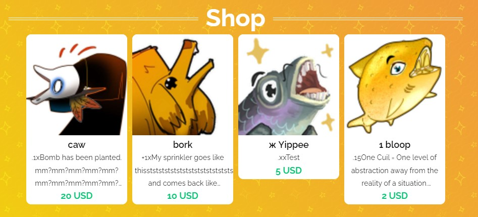
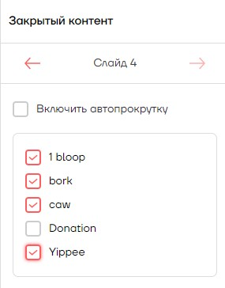
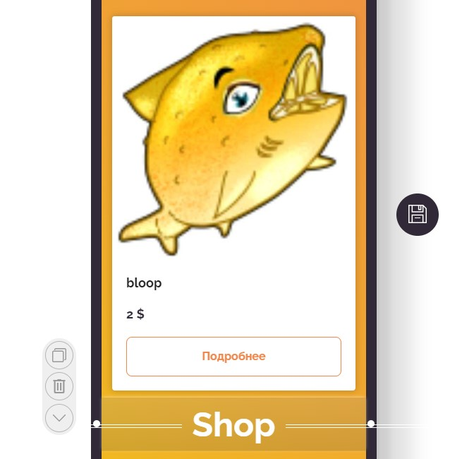
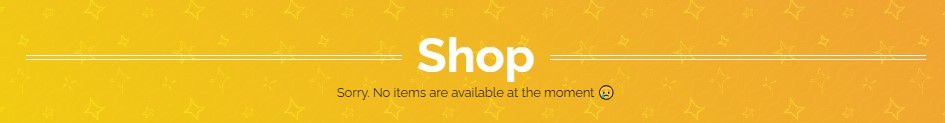
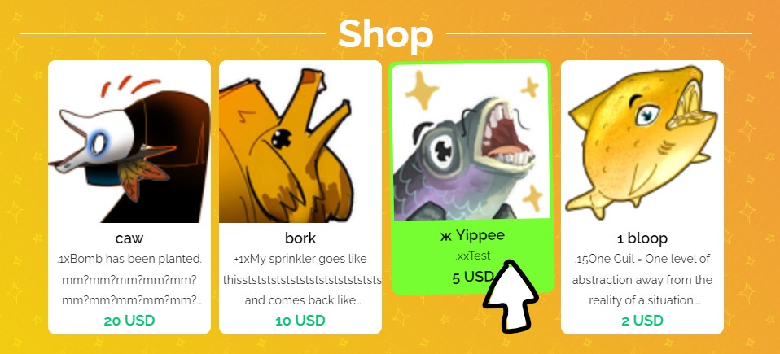

# Галерея товаров для Hipolink на основе закрытого контента вместо слайдера



Для работы этого кода, нужно обязательно установить виджет закрытого контента. Не переживайте, если вам не нравится его вид, он потом будет скрыт кодом моего виджета.

#### Установка виджета:

Сначала кидаем на страничку виджет закрытого контента, и в нём отмечаем, какие товары нужно показать:



На данный момент (конец мая 2024) все товары автоматически показываются строго отсортированными по названию: например, сначала начинающиеся на числа, потом с маленькой лат. буквы, заглавной лат. буквы, маленькой кириллицы, заглавной кириллицы. Мне показалось это не очень логично, поэтому мы это исправим. (Обещают, что потом можно будет сортировать по-другому).

Дальше под этим виджетом добавляем блок HTML.

В него кидаем код:
```html

<style>
div#stuffgal {
    display: flex;
    flex-direction: row;
    flex-wrap: wrap;
    align-content: flex-start;
    justify-content: center;
    align-items: flex-start;
}

#stuffgal div {
    width: calc(100% / 4.5);
    margin: 5px;
    padding-bottom: 5px;
    background: white;
    border-radius: 10px;
    min-width: 190px;
}

#stuffgal img {
    width: 100%;
    border-radius: 10px 10px 0 0;
}

#stuffgal span {
    display: block;
    padding: 0 5px;
}

#stuffgal a {
    line-height: 1.4em;
    font-size: large;
    font-weight: 600;
    text-decoration: none;
    color: black;
}

#stuffgal span.price {
    color: #00c770;
}
#stuffgal div:hover span.price {
    color: black;
}
#stuffgal div:hover {
    background: #76fe33;
    color: white;
    border: 4px #76fe33 solid;
}

#stuffgal div:nth-child(odd):hover {transform:rotate(-1deg);}
#stuffgal div:nth-child(even):hover {transform:rotate(1deg);}

#stuffgal span.text {
    font-size: 0.8em;
    font-weight: 300;
    text-overflow: ellipsis;
    max-height: 100px;
    overflow: hidden;
    display: -webkit-box;
    -webkit-line-clamp: 3;
    -webkit-box-orient: vertical;
}

.ProductWidgetContainer_hasPagination__DCxut {display:none}

h1.list {
    color: white;
    font-size: 3em;
    font-weight: 900;
}

h1.list {
  display: inline-block;
  position: relative;  
}
h1.list:before,
h1.list:after {
  content: "";
  position: absolute;
  height: 5px;
  border-bottom: 1px solid white;
  border-top: 1px solid white;
  top: 50%;
  width: 100vw;
}
h1.list:before {
  right: 100%;
  margin-right: 15px;
}
h1.list:after {
  left: 100%;
  margin-left: 15px;
}
</style>

<div class='HTML__container'>
  <div class='HTML__inner'>
	<h1 class="list">Shop</h1>
    <div id="stuffgal"></div>
  </div>
</div>

<script>
document.addEventListener('DOMContentLoaded', function(){ 
	var ii = 1;
	//console.log("self ", self.__next_f);
	var findprod = '';
	while (ii < self.__next_f.length) {
		if (self.__next_f[ii][1].search('"productsControl"'+':') >= 0 ) 
		{var findprod = self.__next_f[ii][1]; break;} ii++;
	}
	//console.log("prod ", findprod);
	findprod = findprod.split("productsControl");
	findprod = findprod[1].split('"products":[');
	findprod = findprod[1].split('],"id"');
	findprod = findprod[0];

	findprod = '{"products":['+findprod+']}';
	jsonprod = JSON.parse(findprod);
	
	if (jsonprod.products.length > 0 ) {
		jsonprod = jsonprod.products.sort(({price:a}, {price:b}) => b-a);
			
		function printprod(array) {
			var cards = ''; ii = 0;
			while (ii < array.length && array.length > 0) {
			
				cards += '<div><a href="'+window.location.href+'/products/'+array[ii].link+'"><span class="title">'+array[ii].headerText+'</span><span class="text">'+array[ii].descriptionText.content[0].content[0].text+'</span><span class="price">'+array[ii].price+' '+array[ii].currency+'</span></a></div>';
			
				ii++;
			}
			document.getElementById('stuffgal').innerHTML = cards;
		}
		printprod(jsonprod);
	} else {document.getElementById('stuffgal').innerHTML = '<span class="text">Sorry. No items are available at the moment 😢</span>';}

}, false);
</script>

```

В редакторе должно быть вот так - закрытый контент, потом заголовок магазина:



Иии всё!

Теперь на вашей странице вместо слайдера с точечками должна отобразиться галерея как на скрине в самом верху.

Если вы решите убрать товары, сняв все галочки в виджете закрытого контента, или совсем удалите их, то эта галерея просто будет говорить, что сейчас показывать нечего:



#### Что можно поменять:

- **Заголовок**. Если вам не нравится слово "Shop", то его можно заменить в строке `<h1 class="list">Shop</h1>`. Заменять нужно само слово *Shop*, а код вокруг оставить. Можно эту строку вообще убрать, но не рекомендую, потому что тогда в редакторе будет пусто и вам визуально будет сложно найти этот блок HTML.

- **Количество карточек**. Сейчас отображается максимум 4 товара в строке. Можно в начале кода в строке
`#stuffgal div { width: calc(100% / 4.5);` заменить 4.5 на 3.5 (с точкой!), если вам нужно 3, или 2.5 для 2, итд. Но больше 5 не рекомендую, будет сильно мелко.

- **Сортировка**. Сейчас товары сортируются **по цене** по убыванию. Чтобы сделать по возрастанию, можно в строке `jsonprod = jsonprod.products.sort(({price:a}, {price:b}) => b-a);` заменить последнее выражение на `a-b`. (Я подумаю над добавлением кнопок для сортировки, но если учесть, что Хипо скорее всего переработают базовый виджет, у меня это не в приоритете.)

- **Стили**. При желании, можно пошаманить с css.

Например, когда наводите на карточку курсор, она подсвечивается ядрёно зелёным.



Для темы моей страницы норм, но если хотите сменить, то делается в блоке:
```css
#stuffgal div:hover {
    background: #76fe33;
    color: white;
    border: 4px #76fe33 solid;
}
```
Здесь `#76fe33` - это зеленый цвет. Можно воспользоваться любым способом подбора цветов, например [сайтом colorpicker.me](https://colorpicker.me/#76fe33), или просто вбив color picker в поисковике. Выбираете любой HEX цвет и заменяете.

Заметьте, что в css зеленый у меня дважды: первый раз - это фон карточки, второй раз - это цвет обводки.

Можно покреативить и сделать, например, цветную карточку с черной обводкой:
```css
#stuffgal div:hover {
    background: #33a8fe;
    color: white;
    border: 4px #000000 solid;
}
```


[Мой Хипо](https://hipolink.me/ajcrwl). [Бусти](https://boosty.to/doittkarl).